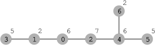

A network consisting of N cities and N − 1 roads is given. Each city is labeled with a distinct integer from 0 to N − 1.

Roads connect cities in such a way that each distinct pair of cities is connected either by a direct road or through a path consisting of direct roads. There is exactly one way to reach any city from any other city.

Each city also has its own attractiveness level, which will be denoted by an integer. City P is more attractive than city Q if the attractiveness level of city P is strictly greater than the attractiveness level of city Q.

You are planning a trip to visit some of the most attractive cities. You want to select cities to visit based on the following requirements:

At most K cities can be included in the trip plan.
It must be possible to travel among the cities included in the trip plan without having to travel through cities that have been excluded from the trip plan.
None of the cities included in the trip plan can be less attractive than any of the excluded cities. City attractiveness levels do not have to be unique, though, so it is permissible to visit only a subset of cities that are equally attractive.
The goal is to maximize the number of cities selected while satisfying the above requirements.

The network of cities is described using arrays C and D, each of length N. Array C describes a network of cities as follows: if C[P] = Q and P ≠ Q, then there is a direct road between cities P and Q. Array D describes attractiveness of the cities: D[P] is the attractiveness level of city P.

For example, consider the following network consisting of seven cities (each circle represents a city: the city label appears inside the circle and its attractiveness level outside the circle):

If K = 2, we can select a maximum number of two cities: either 2 and 0 or 2 and 4. In both cases, the attractiveness levels of the selected cities are greater than or equal to 6 and the attractiveness levels of the excluded cities are less than or equal to 6.

If, however, K = 5, the maximum number of cities we can select according to the rules above is four: we must select cities 2, 0, 4 and 5.

Write a function:

int solution(int K, vector<int> &C, vector<int> &D);

that, given the integer K and non-empty arrays C and D of length N describing a network of cities and their attractiveness, returns the maximum number of cities that can be included in a valid trip plan.

For example, given arrays C and D describing the network above:

    C[0] = 1    D[0] = 6
    C[1] = 3    D[1] = 2
    C[2] = 0    D[2] = 7
    C[3] = 3    D[3] = 5
    C[4] = 2    D[4] = 6
    C[5] = 4    D[5] = 5
    C[6] = 4    D[6] = 2
and K = 2 the function should return 2, as explained above. Similarly, given the same network but with K = 5, the function should return 4, as explained above.

Write an efficient algorithm for the following assumptions:

N is an integer within the range [1..100,000];
K is an integer within the range [1..N];
each element of array C is an integer within the range [0..(N−1)];
there is exactly one (possibly indirect) connection between any two distinct cities;
each element of array D is an integer within the range [0..1,000,000].
  
