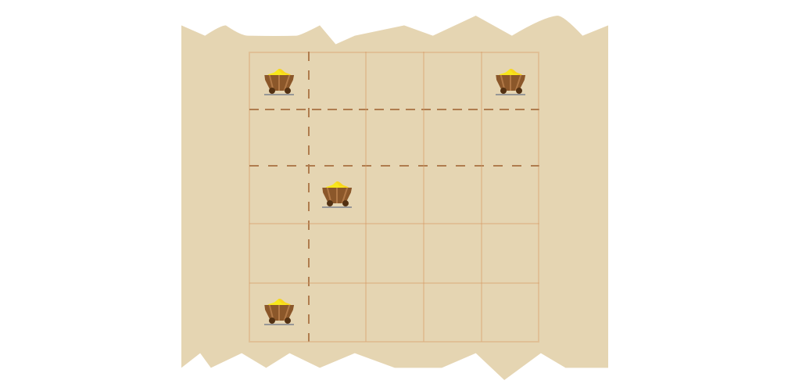

An old king wants to divide his kingdom between his two sons. He is well known for his justness and wisdom, and he plans to make a good use of both of these attributes while dividing his kingdom.

The kingdom is administratively split into square boroughs that form an N × M grid. Some of the boroughs contain gold mines. The king knows that his sons do not care as much about the land as they do about gold, so he wants both parts of the kingdom to contain exactly the same number of mines. Moreover, he wants to split the kingdom with either a horizontal or a vertical line that goes along the borders of the boroughs (splitting no borough into two parts).

The goal is to count how many ways he can split the kingdom.

Write a function:

int solution(int N, int M, vector<int> &X, vector<int> &Y);

that, given two arrays of K integers X and Y, denoting coordinates of boroughs containing the gold mines, will compute the number of fair divisions of the kingdom.

For example, given N = 5, M = 5, X = [0, 4, 2, 0] and Y = [0, 0, 1, 4], the function should return 3. The king can divide his land in three different ways shown on the picture below.

Divide horizontally in two ways or vertically in one way
  
  

                                 
Write an efficient algorithm for the following assumptions:

N and M are integers within the range [1..100,000];
K is an integer within the range [1..100,000];
each element of array X is an integer within the range [0..N-1];
each element of array Y is an integer within the range [0..M-1].
