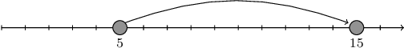

There are N cities (numbered from 0 to N-1) located along a road. The K-th city is situated A[K] from the beginning of the road in the west. Cities are numbered in ascending order of position, and no two of them lie in the same place. Formally, A[K] < A[K + 1] holds for every K from 0 to N-2.

The time needed to travel east from city X to the easternmost city equals A[N - 1] - A[X] unless there is a city Y to the east of X (as cars can drive only to the east) with a motorway to the easternmost city built. Then, travel time decreases to A[Y] - A[X] (time spent on the motorway is not considered). If city X has a motorway built, then the travel time from it equals 0.

There are no motorways right now, but one from any city to the easternmost city is planned to be built. Decide where to build it in order to minimize the sum of travel times from every city to the easternmost one.

Write a function:

int solution(vector<int> &A);

that, given an array A of N integers, returns the minimum total travel time as described above.

 As the result might be large, return its remainder when divided by 109 + 7.

Examples:

1. Given A = [1, 5, 9, 12], the function should return 7.

With the motorway from the 0th city the travel times would be: 0 for the 0th city as it has a motorway, 7 for the 1st city and 3 for the 2nd city: that is 10 in total.
With the motorway from the 1st city the travel times would be: 4 for the 0th city, 0 for the 1st city and 3 for the 2nd city: that is 7 in total.
With the motorway from the 2nd city the travel times would be: 8 for the 0th city, 4 for the 1st city and 0 for the 2nd city: that is 12 in total.
  
 

2. If A = [5, 15], the function should return 0.

We can only build a motorway from the 0th city to the 1st. Travel time from the city to the motorway is 0, so 0 is the answer.

 

3. If A = [2, 6, 7, 8, 12], the function should return 9.

With the motorway from the 0th city the total travel time is equal to 0 + 6 + 5 + 4 = 15.
With the motorway from the 1st city the total travel time is equal to 4 + 0 + 5 + 4 = 13.
With the motorway from the 2nd city the total travel time is equal to 5 + 1 + 0 + 4 = 10.
With the motorway from the 3rd city the total travel time is equal to 6 + 2 + 1 + 0 = 9.
The answer is 9, because that is the minimum total time among all motorway placement possibilities.

  
4. If N = 20 and A[K] = K * (5 * 107) for each K from 0 to 19, the function should return 499999972. The minimal total time among all motorway placement possibilities is 4500000000, whose remainder when divided by 109 + 7 is 499999972.

Write an efficient algorithm for the following assumptions:

N is an integer within the range [2..100,000];
each element of array A is an integer within the range [0..1,000,000,000];
the elements of A are all distinct;
array A is sorted in ascending order.
