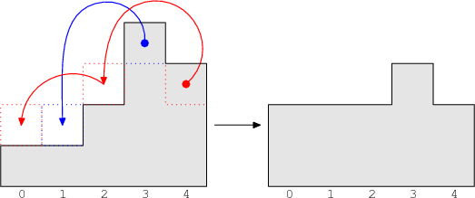

There are N towers of stones, numbered from 0 to N−1. The K-th tower contains A[K] stones. In one turn, you can move a single stone from tower K to one of towers K−2, K−1, K+1 or K+2. You can move a stone only to existing towers. For example, from tower 0 you can move a stone only to tower 1 or 2, and from tower 1 you can move a stone only to towers 0, 2 and 3.

What is the minimum number of turns needed to rearrange the stones such that on the K-th tower there will be B[K] stones?

Write a function

int solution(vector<int> &A, vector<int> &B);

that, given two arrays A and B of N integers each, representing the initial and final arrangements of the stones, returns the minimum number of turns needed to rearrange the stones. Since the answer can be very large, provide it modulo 109 + 7 (1,000,000,007). If rearrangement is impossible, your function should return −1.

Examples

1. Given A = [1, 1, 2, 4, 3], B = [2, 2, 2, 3, 2], your function should return 3. You can move one stone from tower 3 to tower 1 using one turn and one from tower 4 to tower 0 using two turns (4 → 2 → 0).

2. Given A = [0, 0, 2, 1, 8, 8, 2, 0], B = [8, 5, 2, 4, 0, 0, 0, 2], your function should return 31. One possible sequence of moves is as follows:

move 8 stones from tower 4 to 0 (16 turns),
move 8 stones from tower 5 to 3 (8 turns),
move 5 stones from tower 3 to 1 (5 turns),
move 2 stones from tower 6 to 7 (2 turns).
3. Given A = [109, 109, 109, 0, 0, 0], B = [0, 0, 0, 109, 109, 109], your function should return 999999972. Possible sequence of moves:

move all stones from tower 0 to 5 (3*109 turns),
move all stones from tower 1 to 3 (109 turns),
move all stones from tower 2 to 4 (109 turns).
The total number of turns is 5*109, so the answer is 5*109 mod (109+7) = 999999972.

4. Given A = [2] and B = [1] your function should return −1.

Write an efficient algorithm for the following assumptions:

N is an integer within the range [1..100,000];
arrays A and B have the same length N;
each element of arrays A and B is an integer within the range [0..1,000,000,000].
