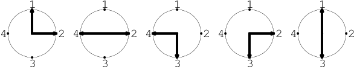
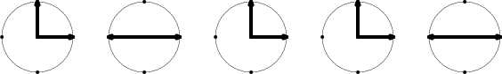

You are given N round clocks.

Every clock has M hands, and these hands can point to positions 1, 2, 3, ..., P (yes, these represent numbers around each face). The clocks are represented by the matrix A consisting of N rows and M columns of integers. The first row represents the hands of the first clock, and so on.

For example, you are given matrix A consisting of five rows and two columns, and P = 4:

  A[0][0] = 1    A[0][1] = 2
  A[1][0] = 2    A[1][1] = 4
  A[2][0] = 4    A[2][1] = 3
  A[3][0] = 2    A[3][1] = 3
  A[4][0] = 1    A[4][1] = 3
  
  

You can rotate the clocks to obtain several clocks that look identical. For example, if you rotate the third, fourth and fifth clocks you can obtain the following clocks:

  

After rotation, the first, third and fourth clocks look the same, and the second clock looks the same as the fifth one. That means there are four pairs of clocks that look the same: (1, 3), (1, 4), (2, 5) and (3, 4).

Write a function:

int solution(vector< vector<int> > &A, int P);

that, given a zero-indexed matrix A consisting of N rows and M columns of integers and integer P, returns the maximal number of pairs of clocks that can look the same after rotation.

For example, given the following array A and P = 4:

    A[0][0] = 1     A[0][1] = 2
    A[1][0] = 2     A[1][1] = 4
    A[2][0] = 4     A[2][1] = 3
    A[3][0] = 2     A[3][1] = 3
    A[4][0] = 1     A[4][1] = 3
the function should return 4, as explained above.

Write an efficient algorithm for the following assumptions:

N and M are integers within the range [1..500];
P is an integer within the range [1..1,000,000,000];
each element of matrix A is an integer within the range [1..P];
the elements of each row of matrix A are all distinct.
