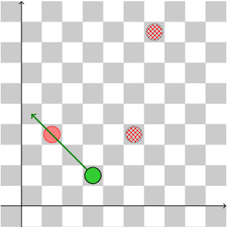
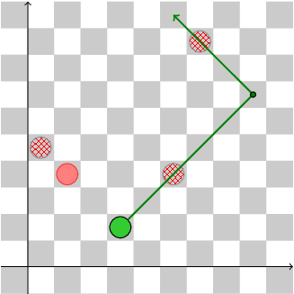
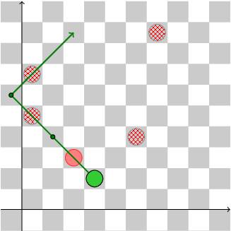

Given positions of all enemy figures and your figure (queen) in checkers game, count the maximum number of points (1 for pawn, 10 for queen) you can earn by beating enemy's figures in one round.
Task Score
100%
Correctness
100%
Performance
100%
Task description
Chin is fighting with his mortal enemy, Cho. Chin and Cho are pacifists, so their fight is actually a game of checkers on an infinite board. There are two types of pieces in checkers: pawns and queens. Chin is left with his last piece: a queen. Now it is Chin's turn − the last turn in the game.

Pieces can move only diagonally and forward. A pawn always moves one step in the up-right or up-left direction. A queen can move any number of steps in one of these two directions.

If there is a piece belonging to Cho on the line of Chin's queen's movement, Chin can beat it by leaping over it and optionally passing some more empty fields. Chin can beat only one of Cho's pieces in one move. After beating one of Cho's pieces in this way, Chin can continue his turn and make another move, but only if he can beat another piece.

Chin gains 1 point for beating a pawn and 10 points for beating a queen. Now Chin wants to know the maximum number of points he can score in a single turn. Can you help?

Write a function:

int solution(vector<int> &X, vector<int> &Y, string &T);

that, given the positions of all the pieces on the board, counts the maximum number of points Chin can score in one turn. X and Y are arrays of N coordinates of pieces: an K-th piece (0 ≤ K < N) occupies board position (X[K], Y[K]); i.e. it appears in the X[K]-th column and Y[K]-th row. Each piece occupies a black field.

T is a string of N characters in which the K-th character represents the type of the K-th piece: 'p' represents one of Cho's pawns and 'q' one of Cho's queens, whilst 'X' represents Chin's queen.

For example, given:

    X = [3, 5, 1, 6]
    Y = [1, 3, 3, 8]
    T = "Xpqp"
the function should return 10. This situation is depicted in the following illustration. Chin's queen is green, Cho's pawns are checked red and her queens are plain red. The optimal turn (sequence of moves) is marked by a green path.

Given:

    X = [0, 3, 5, 1, 6]
    Y = [4, 1, 3, 3, 8]
    T = "pXpqp"
the function should return 2. Note that Chin's queen cannot jump over Cho's queen as her pawn is right behind it.

Finally, given:

    X = [0, 6, 2, 5, 3, 0]
    Y = [4, 8, 2, 3, 1, 6]
    T = "ppqpXp"
the function should return 12. Remember that the board is infinite and the queen can jump onto cells with negative coordinates.
  
  

Write an efficient algorithm for the following assumptions:

arrays X, Y and string T have the same length N;
N is an integer within the range [1..100,000];
each element of arrays X and Y is an integer within the range [0..100,000,000];
no two pieces have the same coordinates;
each piece is located on a black field (field (0, 0) is black);
string T is made only of the following characters: 'p', 'q' and/or 'X';
string T contains exactly one character "X".
