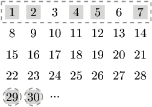

You want to buy public transport tickets for some upcoming days. You know exactly the days on which you will be traveling. There are three types of ticket:

1-day ticket, costs 2, valid for one day;
7-day ticket, costs 7, valid for seven consecutive days (e.g. if the first valid day is X, then the last valid day is X+6);
30-day ticket, costs 25, valid for thirty consecutive days.
You want to pay as little as possible having valid tickets on your travelling days.

You are given a sorted (in increasing order) array A of days when you will be traveling. For example, given:

    A[0] = 1  
    A[1] = 2  
    A[2] = 4   
    A[3] = 5 
    A[4] = 7 
    A[5] = 29 
    A[6] = 30 
    
you can buy one 7-day ticket and two 1-day tickets. The two 1-day tickets should be used on days 29 and 30. The 7-day ticket should be used on the first seven days. The total cost is 11 and there is no possible way of paying less.

Write a function:

int solution(vector<int> &A);

that, given an array A consisting of N integers that specifies days on which you will be traveling, returns the minimum amount of money that you have to spend on tickets.

For example, given the above data, the function should return 11, as explained above.

Write an efficient algorithm for the following assumptions:

M is an integer within the range [1..100,000];
each element of array A is an integer within the range [1..M];
N is an integer within the range [1..M];
array A is sorted in increasing order;
the elements of A are all distinct.
