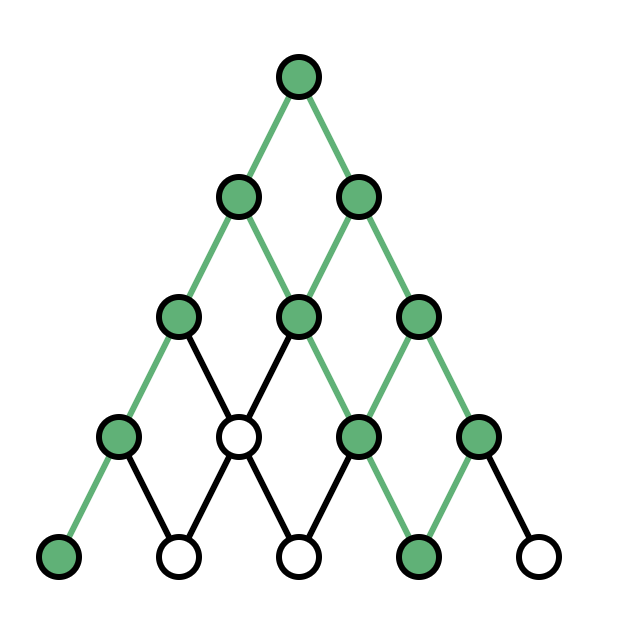

On the sequence of logical values (true or false) we can build up an OR-Pascal-triangle structure. Instead of summing the values, as in a standard Pascal-triangle, we will combine them using the OR function. That means that the lowest row is simply the input sequence, and every entry in each subsequent row is the OR of the two elements below it. For example, the OR-Pascal-triangle built on the array [true, false, false, true, false] is as follows:

Your job is to count the number of nodes in the OR-Pascal-triangle that contain the value true (this number is 11 for the animation above).

Write a function:

int solution(vector<bool> &P);

that, given an array P of N Booleans, returns the number of fields in the OR-Pascal-triangle built on P that contain the value true. If the result is greater than 1,000,000,000, your function should return 1,000,000,000.

Given P = [true, false, false, true, false], the function should return 11, as explained above.

Given P = [true, false, false, true], the function should return 7, as can be seen in the animation below.
  

Write an efficient algorithm for the following assumptions:

N is an integer within the range [1..100,000].
