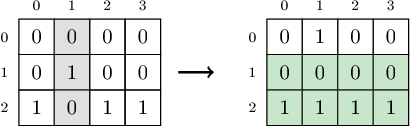
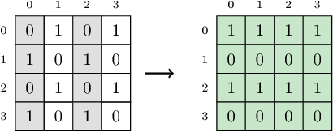

Matrix A, consisting of N rows and M columns, is given, with each cell containing the value 0 or 1. Rows are numbered from 0 to N−1 (from top to bottom). Columns are numbered from 0 to M−1 (from left to right). The values inside the matrix can be changed: you can select as many columns as you want, and in the selected column(s), every value will be flipped (from 0 to 1, or from 1 to 0).

The goal is to obtain the maximum number of rows whose contents are all the same value (that is, we count rows with all 0s and rows with all 1s).

Write a function:

int solution(vector< vector<int> > &A);

that, given matrix A, returns the maximum number of rows containing all the same values that can be obtained after flipping the selected columns.

Examples:

1. Given matrix A with N = 3 rows and M = 4 columns:

the function should return 2. After flipping the values in column 1, the two last rows contain all equal values. Row 1 contains all 0s and row 2 contains all 1s.

2. Given matrix A with N = 4 rows and M = 4 columns:

  
 the function should return 4. After flipping the values in two of the columns (columns 0 and 2), all the rows have the same value. Rows number 0 and 2 contain all 1s, and rows number 1 and 3 contain all 0s.

Write an efficient algorithm for the following assumptions:

N and M are integers within the range [1..100,000];
N * M is not greater than 100,000.
