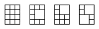
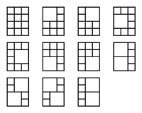

A board consisting of squares arranged into N rows and M columns is given. A tiling of this board is a pattern of tiles that covers it. A tiling is interesting if:

only tiles of size 1x1 and/or 2x2 are used;
each tile of size 1x1 covers exactly one whole square;
each tile of size 2x2 covers exactly four whole squares;
each square of the board is covered by exactly one tile.
For example, the following images show a few interesting tilings of a board of size 4 rows and 3 columns:

Two interesting tilings of a board are different if there exists at least one square on the board that is covered with a tile of size 1x1 in one tiling and with a tile of size 2x2 in the other. For example, all tilings shown in the images above are different.

Write a function:

int solution(int N, int M);

that, given two integers N and M, returns the remainder modulo 10,000,007 of the number of different interesting tilings of a board of size N rows and M columns.

For example, given N = 4 and M = 3, the function should return 11, because there are 11 different interesting tilings of a board of size 4 rows and 3 columns:

Write an efficient algorithm for the following assumptions:

N is an integer within the range [1..1,000,000];
M is an integer within the range [1..7].
