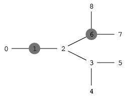

There are N+1 intersections in a prison, connected by N corridors, and one can move between any two intersections using the corridors. Intersections with only one corridor are located near the exits from the prison.

There is a cell block near every intersection. Exactly M cell blocks hold prisoners; others are empty. Due to a malfunction in the locking system, all the cells have been opened. The situation is critical and the governor of the prison needs to know where to position the guards in order to prevent the prisoners from escaping.

You are given a map of the prison in the form of two arrays A, B of length N and an array C of length M:

For each I (0 ≤ I < N) there is a corridor between intersections A[I] and B[I].
For each I (0 ≤ I < M) there are prisoners in the cell block near intersection C[I].
A guard can be located at an intersection, but not at an intersections near to a cell block which initially held prisoners. Prisoners from a cell block located near intersection X can escape from the prison if there is a path from X to an intersection located near an exit from the prison and there are no guards at any intersection along this path. The governor would like to know the minimum number of guards he must deploy in the operation.

Write a function:

int solution(vector<int> &A, vector<int> &B, vector<int> &C);

that, given arrays A, B of N integers and array C of M integers, returns the minimum number of guards that can prevent all prisoners from escaping. If there is no way to prevent an escape of some prisoner, the function should return −1.

For example, given the following arrays:

    A[0] = 0    B[0] = 1    C[0] = 1
    A[1] = 1    B[1] = 2    C[1] = 6
    A[2] = 2    B[2] = 3
    A[3] = 3    B[3] = 4
    A[4] = 3    B[4] = 5
    A[5] = 2    B[5] = 6
    A[6] = 6    B[6] = 8
    A[7] = 6    B[7] = 7
  
  
 

the function should return 4. Four guards can be positioned at the intersections numbered 0, 3, 7 and 8 (another solution would be to position guards at intersections 0, 2, 7 and 8). By positioning three or fewer guards, the governor is unable to prevent some prisoners from escaping.

Write an efficient algorithm for the following assumptions:

N is an integer within the range [1..200,000];
M is an integer within the range [0..N+1];
each element of arrays A, B and C is an integer within the range [0..N];
the elements of C are all distinct;
distance from intersection 0 to any other intersection is not greater than 500.
