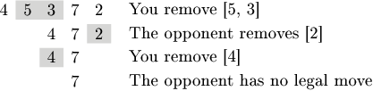

Even sums is a game for two players. Players are given a sequence of N positive integers and take turns alternately. In each turn, a player chooses a non-empty slice (a subsequence of consecutive elements) such that the sum of values in this slice is even, then removes the slice and concatenates the remaining parts of the sequence. The first player who is unable to make a legal move loses the game.

You play this game against your opponent and you want to know if you can win, assuming both you and your opponent play optimally. You move first.

Write a function:

string solution(vector<int> &A);

that, given an array A consisting of N integers, returns a string of format "X,Y" where X and Y are, respectively, the first and last positions (inclusive) of the slice that you should remove on your first move in order to win, assuming you have a winning strategy. If there is more than one such winning slice, the function should return the one with the smallest value of X. If there is more than one slice with the smallest value of X, the function should return the shortest. If you do not have a winning strategy, the function should return "NO SOLUTION".

For example, given the following array:

  A[0] = 4  
  A[1] = 5  
  A[2] = 3  
  A[3] = 7  
  A[4] = 2  
  
the function should return "1,2". After removing a slice from positions 1 to 2 (with an even sum of 5 + 3 = 8), the remaining array is [4, 7, 2]. Then the opponent will be able to remove the first element (of even sum 4) or the last element (of even sum 2). Afterwards you can make a move that leaves the array containing just [7], so your opponent will not have a legal move and will lose. One of possible games is shown on the following picture:

Note that removing slice "2,3" (with an even sum of 3 + 7 = 10) is also a winning move, but slice "1,2" has a smaller value of X.

For the following array:

  A[0] = 2
  A[1] = 5
  A[2] = 4
the function should return "NO SOLUTION", since there is no strategy that guarantees you a win.

Write an efficient algorithm for the following assumptions:

N is an integer within the range [1..100,000];
each element of array A is an integer within the range [1..1,000,000,000].
