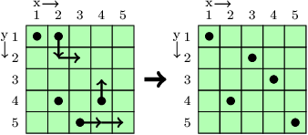
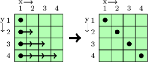
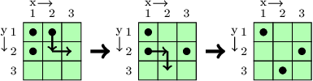

Joe the Farmer owns a square plot of farmland whose sides are of length N. The land is split into N rows and N columns of equal size, so that there are N2 identical square fields within the farmland. Thanks to the abundant crops that Joe harvested last year, he could afford to buy N sprinklers. They significantly reduce the amount of time that Joe spends watering his plants.

Every sprinkler can be placed in any field of the farmland, but no two sprinklers can occupy the same field. Upon activation, each sprinkler irrigates every field within the same column and row in which it appears.

After delivery, the sprinklers were placed in a batch, so the K-th sprinkler is positioned in field (XK, YK). Joe knows that this arrangement is not optimal, as some fields may not be watered by any sprinkler. Moreover, no column or row should be watered by more than one sprinkler, as it may cause over-hydration of the crops.

In one move, the farmer can move a single sprinkler to an adjacent unoccupied field. Two fields are adjacent to one another if they have a common side.

What is the minimum number of moves required to rearrange the sprinklers so that all fields will be irrigated by sprinklers, and no two sprinklers will water the same column or row? Since the answer can be very large, provide it modulo 1,000,000,007 (109 + 7).

Write a function:

int solution(vector<int> &X, vector<int> &Y);

that, given arrays X and Y, both consisting of N integers and representing the coordinates of consecutive sprinklers, returns a minimal number of moves modulo 1,000,000,007, required to irrigate all fields.

For example, given array X = [1, 2, 2, 3, 4] and array Y = [1, 1, 4, 5, 4] the function should return 5, as we can make following moves:
  
  

For another example, given array X = [1, 1, 1, 1] and array Y = [1, 2, 3, 4] the function should return 6:
  
  

Given array X = [1, 1, 2] and array Y = [1, 2, 1] the function should return 4:
 
 

Write an efficient algorithm for the following assumptions:

N is an integer within the range [2..100,000];
each element of arrays X and Y is an integer within the range [1..N];
each sprinkler appears in a distinct field (no field may contain more than one sprinkler).
