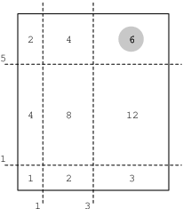

You are presented with a rectangular cake whose sides are of length X and Y. The cake has been cut into (N + 1)2 pieces by making N straight cuts along the first side and N straight cuts along the second side.

The cuts are represented by two non-empty arrays A and B consisting of N integers. More precisely, A[I] such that 0 ≤ I < N represents the position of a cut along the first side, and B[I] such that 0 ≤ I < N represents the position of a cut along the second side.

The goal is to find the K-th piece of cake in order of size, starting with the largest piece first. We will consider the size of a piece to be its area.

For example, a cake with sides X = 6, Y = 7 and arrays A and B such that:

    A[0] = 1    B[0] = 1
    A[1] = 3    B[1] = 5
is represented by the figure below.

There are nine pieces of cake, and their consecutive sizes are: 12, 8, 6, 4, 4, 3, 2, 2, 1. In the figure above, the third piece of cake is highlighted; its size equals 6.

Write a function:

int solution(int X, int Y, int K, vector<int> &A, vector<int> &B);

that, given three integers X, Y, K and two non-empty arrays A and B of N integers, returns the size of the K-th piece of cake.

For example, given:

    X = 6   Y = 7   K = 3
    A[0] = 1    B[0] = 1
    A[1] = 3    B[1] = 5
the function should return 6, as explained above.

Write an efficient algorithm for the following assumptions:

N is an integer within the range [1..40,000];
X and Y are integers within the range [2..400,000,000];
K is an integer within the range [1..(N+1)*(N+1)];
each element of array A is an integer within the range [1..X-1];
each element of array B is an integer within the range [1..Y-1];
A[I − 1] < A[I] and B[I − 1] < B[I], for every I such that 0 < I < N;
1 ≤ A[I] − A[I − 1], B[I] − B[I − 1] ≤ 10,000, for every I such that 0 < I < N;
1 ≤ A[0], B[0], X − A[N − 1], Y − B[N − 1] ≤ 10,000.
