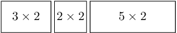
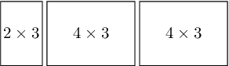
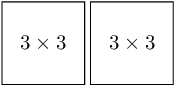
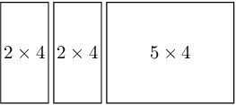

There are N rectangles numbered from 0 to N-1. The K-th rectangle has size A[K] × B[K].

We want to arrange as many rectangles as possible into a strip. The rectangles can be arranged into a strip if they all share a side of the same length (which becomes the height of the strip). Note that rectangles can be rotated.

Write a function:

int solution(vector<int> &A, vector<int> &B);

that, given two arrays A and B of N integers each, returns the maximum number of rectangles that can be arranged into a strip.

Examples:

1. Given A = [2, 3, 2, 3, 5] and B = [3, 4, 2, 4, 2], the function should return 3. Choosing the 0th, 2nd and 4th rectangles we can obtain the following strip of height 2 (note that the 0th rectangle was rotated):

We can also choose the 0th, 1st and 3rd rectangles to obtain a strip of height 3. Here we have rotated 1st and 3rd rectangles:

2. Given A = [2, 3, 1, 3] and B = [2, 3, 1, 3], the function should return 2. We can choose the 1st and 3rd rectangles:

3. Given A = [2, 10, 4, 1, 4] and B = [4, 1, 2, 2, 5], the function should return 3. We can choose the 0th, 2nd and 4th rectangles to obtain a strip of height 4:

Write an efficient algorithm for the following assumptions:

N is an integer within the range [1..100,000];
arrays A and B both consist of N integers;
each element of arrays A and B is an integer within the range [1..1,000,000,000].
