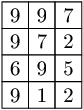
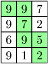

You are given a matrix A consisting of N rows and M columns, where each cell contains a digit. Your task is to find a continuous sequence of neighbouring cells, starting in the top-left corner and ending in the bottom-right corner (going only down and right), that creates the biggest possible integer by concatenation of digits on the path. By neighbouring cells we mean cells that have exactly one common side.

Write a function:

class Solution { public String solution(int[][] A); }

that, given matrix A consisting of N rows and M columns, returns a string which represents the sequence of cells that we should pick to obtain the biggest possible integer.

For example, given the following matrix A:

the function should return "997952", because you can obtain such a sequence by choosing a path as shown below:

Write an efficient algorithm for the following assumptions:

N and M are integers within the range [1..1,000];
each element of matrix A is an integer within the range [1..9].
