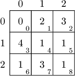
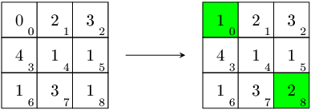
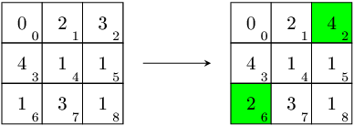
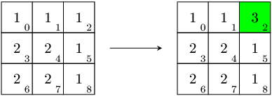

You are given a matrix, consisting of three rows and three columns, represented as an array A of nine integers. The rows of the matrix are numbered from 0 to 2 (from top to bottom) and the columns are numbered from 0 to 2 (from left to right). The matrix element in the J-th row and K-th column corresponds to the array element A[J*3 + K]. For example, the matrix below corresponds to array [0, 2, 3, 4, 1, 1, 1, 3, 1].

In one move you can increment any element by 1.

Your task is to find a matrix whose elements in each row and each column sum to an equal value, which can be constructed from the given matrix in a minimal number of moves.

Write a function:

vector<int> solution(vector<int> &A);

that, given an array A of nine integers, returns an array of nine integers, representing the matrix described above. If there are several possible answers, the function may return any of them.

Examples:

1. Given A = [0, 2, 3, 4, 1, 1, 1, 3, 1], the function could return [1, 2, 3, 4, 1, 1, 1, 3, 2]. The sum of elements in each row and each column of the returned matrix is 6. Two increments by 1 are enough. You can increment A[0] and A[8] (top-left and bottom-right matrix elements). This gives [1, 2, 3, 4, 1, 1, 1, 3, 2], which satisfies the statement's conditions. Alternatively, you can increment A[2] and A[6] (top-right and bottom-left matrix elements). This gives another correct solution: [0, 2, 4, 4, 1, 1, 2, 3, 1].

       

2. Given A = [1, 1, 1, 2, 2, 1, 2, 2, 1], the function should return [1, 1, 3, 2, 2, 1, 2, 2, 1]. The sum of elements in each row and each column of the returned matrix is 5. Two increments by 1 are enough. You can increment A[2] (top-right matrix element) twice. In this case, there are no other correct solutions.

Write an efficient algorithm for the following assumptions:

array A contains nine elements;
each element of array A is an integer within the range [0..100,000,000].
