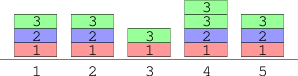
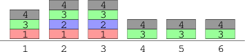
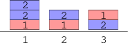
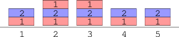

There is a cake factory producing K-flavored cakes. Flavors are numbered from 1 to K. A cake should consist of exactly K layers, each of a different flavor. It is very important that every flavor appears in exactly one cake layer and that the flavor layers are ordered from 1 to K from bottom to top. Otherwise the cake doesn't taste good enough to be sold. For example, for K = 3, cake [1, 2, 3] is well-prepared and can be sold, whereas cakes [1, 3, 2] and [1, 2, 3, 3] are not well-prepared.

The factory has N cake forms arranged in a row, numbered from 1 to N. Initially, all forms are empty. At the beginning of the day a machine for producing cakes executes a sequence of M instructions (numbered from 0 to M−1) one by one. The J-th instruction adds a layer of flavor C[J] to all forms from A[J] to B[J], inclusive.

What is the number of well-prepared cakes after executing the sequence of M instructions?

Write a function:

int solution(int N, int K, vector<int> &A, vector<int> &B, vector<int> &C);

that, given two integers N and K and three arrays of integers A, B, C describing the sequence, returns the number of well-prepared cakes after executing the sequence of instructions.

Examples:

1. Given N = 5, K = 3, A = [1, 1, 4, 1, 4], B = [5, 2, 5, 5, 4] and C = [1, 2, 2, 3, 3].

There is a sequence of five instructions:

The 0th instruction puts a layer of flavor 1 in all forms from 1 to 5.
The 1st instruction puts a layer of flavor 2 in all forms from 1 to 2.
The 2nd instruction puts a layer of flavor 2 in all forms from 4 to 5.
The 3rd instruction puts a layer of flavor 3 in all forms from 1 to 5.
The 4th instruction puts a layer of flavor 3 in the 4th form.

The function should return 3. The cake in form 3 is missing flavor 2, and the cake in form 5 has additional flavor 3. The well-prepared cakes are forms 1, 2 and 5.

2. Given N = 6, K = 4, A = [1, 2, 1, 1], B = [3, 3, 6, 6] and C = [1, 2, 3, 4],

the function should return 2. The 2nd and 3rd cakes are well-prepared.

3. Given N = 3, K = 2, A = [1, 3, 3, 1, 1], B = [2, 3, 3, 1, 2] and C = [1, 2, 1, 2, 2],

the function should return 1. Only the 2nd cake is well-prepared.

4. Given N = 5, K = 2, A = [1, 1, 2], B = [5, 5, 3] and C = [1, 2, 1],

the function should return 3. The 1st, 4th and 5th cakes are well-prepared.

Write an efficient algorithm for the following assumptions:

N is an integer within the range [1..100,000];
M is an integer within the range [1..200,000];
each element of arrays A and B is an integer within the range [1..N];
each element of array C is an integer within the range [1..K];
for every integer J, A[J] ≤ B[J];
arrays A, B and C have the same length, equal to M.
