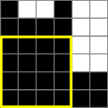

You are given an N × N matrix in which every cell is colored black or white. Columns are numbered from 0 to N-1 (from left to right). This coloring is represented by a non-empty array of integers A. If the K-th number in the array is equal to X then the X lowest cells in the K-th column of the matrix are black. The rest of the cells in the K-th column are white. The task is to calculate the side length of the biggest black square (a square containing only black cells).

Write a function:

int solution(vector<int> &A);

that, given an array of integers A of length N representing the coloring of the matrix, returns the side length of the biggest black square.

Examples:

1. Given A = [1, 2, 5, 3, 1, 3], the function should return 2. For example, the black square of side 2 contains the two lowest rows of the 1st and 2nd columns (counting from 0).

2. Given A = [3, 3, 3, 5, 4], the function should return 3. For example, the biggest black square has side 3 and contains the three lowest rows of the last three columns.

3. Given A = [6, 5, 5, 6, 2, 2], the function should return 4. The biggest black square has side 4 and contains the four lowest rows of the first four columns.

Write an efficient algorithm for the following assumptions:

N is an integer within the range [1..100,000];
