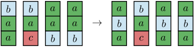
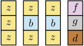
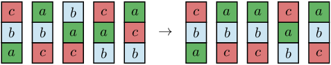

There are N towers, each made of three single-colored blocks placed one on top of another. The colors of the towers' blocks are described in an array T made of N three-letter strings. String T[K] (for K within the range 0..N−1) describes the colors of the blocks from the bottom to the top of the K-th tower. Colors are represented by lowercase letters.

For each of the towers, we may − at most once − choose two adjacent blocks and swap them. For example, given T[K] = "abc", we may obtain "bac" by swapping the bottom two blocks or "acb" by swapping the top two blocks, or stick with "abc" by not making a swap at all. Our goal is to achieve the same order of colors (from the bottom to the top) in as many towers as possible.

What is the maximum number of towers with the same color order that we can obtain?

Write a function:

int solution(vector<string> &T);

that, given an array T consisting of N strings representing the towers' colors, returns the maximum number of towers that we can obtain with the same order of block colors.

Examples:

1. Given T = ["aab", "cab", "baa", "baa"], the function should return 3. We may create towers ["aba", "cab", "aba", "aba"] by swapping the top two blocks in tower number 0, the bottom two blocks in towers with numbers 2 and 3. This way, towers numbers 0, 2 and 3 will have the same order of colors.

2. Given T = ["zzz", "zbz", "zbz", "dgf"], the function should return 2. It is not necessary to perform any swaps to obtain the result.

 
  

3. Given T = ["abc", "cba", "cab", "bac", "bca"], the function should return 3.

  
  
  To achieve the result we need to
  swap two top blocks of the middle tower and two bottom blocks of the last tower, achieving
  three towers with colors "cba". 

Write an efficient algorithm for the following assumptions:

N is an integer within the range [1..50,000];
each string in array T consists only of lowercase letters (a−z);
each string in array T is of length 3.
